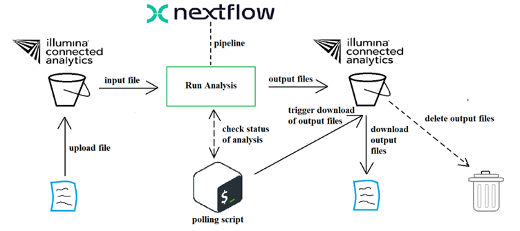
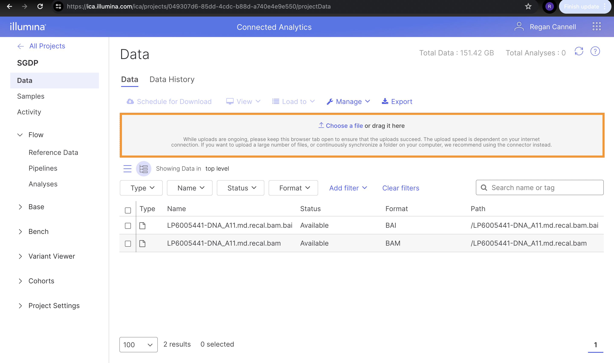
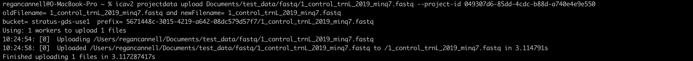
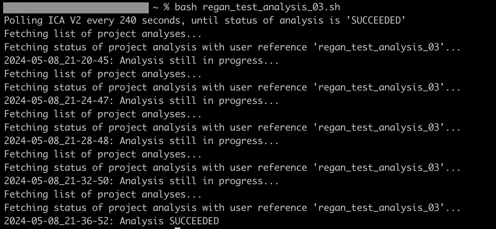
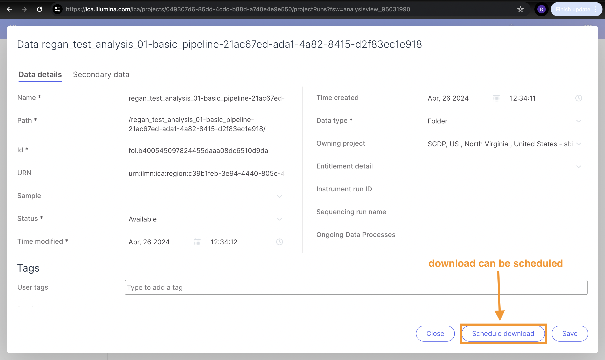
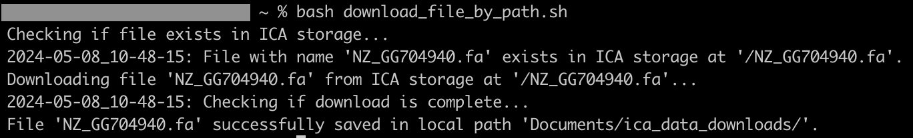
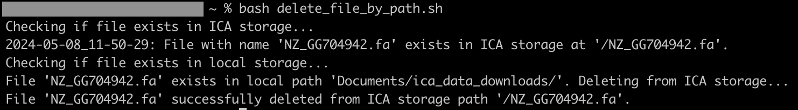
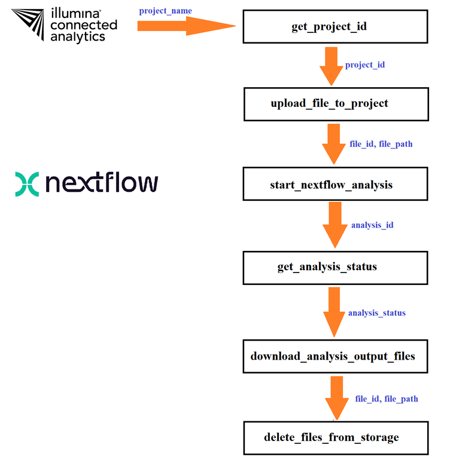
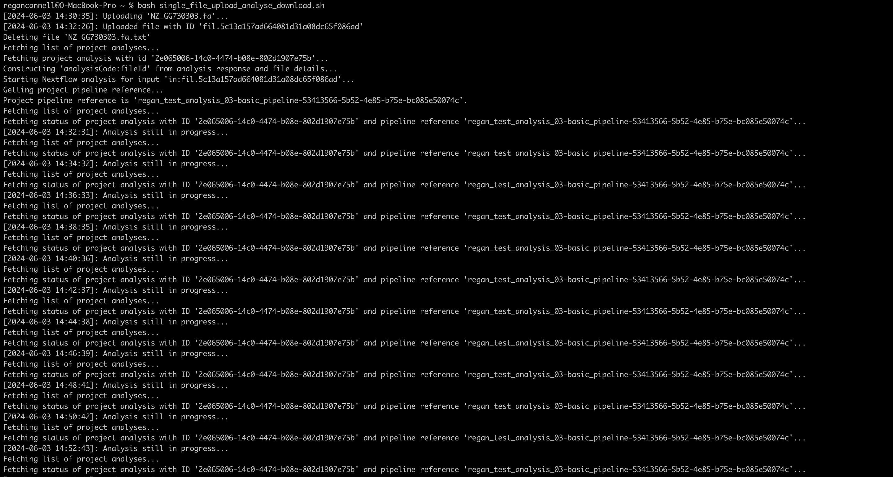
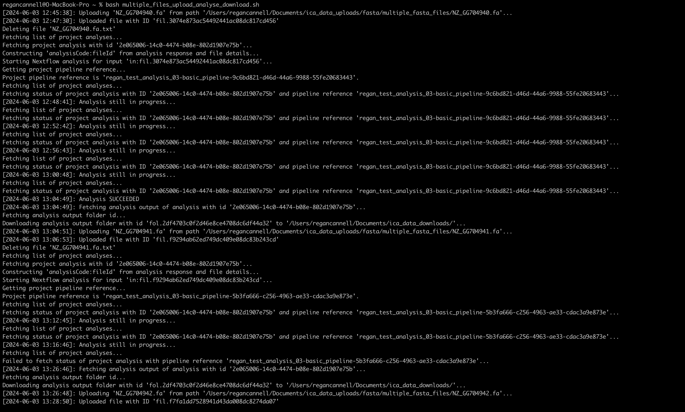

# ica-v2-poc   
## Introduction   
This is a simple proof of concept (POC) for automating certain processes that use the _Illumina Connected Analytics (ICA)_ CLI. The main processes that we wish to automate are:   

- uploading files for analysis
- run Nextflow pipelines for analysis
- trigger download of output file(s)
- delete output file after download succeeds   

We can use a combination of both the [API](https://ica.illumina.com/ica/api/swagger/index.html#/) and the [CLI](https://help.ica.illumina.com/command-line-interface/cli-indexcommands). However, we will almost exclusively use the CLI.   

Before we can begin, we need to have an existing project or create a new project. For the rest of this README, we'll be referring to the existing project, **SGDP**.   

## Authentication
Authentication is required in order to use the API or the CLI. After logging in to the UI, an API key needs to be created. Instructions for generating an API key can be found over [here](https://help.ica.illumina.com/account-management/am-iam#api-keys).   

There are two ways to authenticate in order to make use of the API:
1. API key + JWT for the entire API, except for the POST `/tokens` endpoint.
2. API key + Basic Authentication (username/email and password) for the POST `/tokens` endpoint.    

When using the CLI, authentication takes place when running the command:
```bash
icav2 config set
```
There will be prompts. The defaults can be used by simply pressing `Enter` or `Return`. When the API key is prompted, provide the value that has been generated in the UI. 
```bash
icav2 config set
Creating $HOME/.icav2/config.yaml
Initialize configuration settings [default]
server-url [ica.illumina.com]: 
x-api-key : myAPIKey
output-format (allowed values table,yaml,json defaults to table) : 
colormode (allowed values none,dark,light defaults to none) :
```
The `$HOME/.icav2/config.yaml` file can be modified if the default settings are wished to be changed. In our case, our output format is JSON.   

Our goal is to create a process for the uploading of data to ICA, starting a pipeline run (or analysis) of the uploaded data, check the status of the analysis or output files periodically, download the results, and then finally clean up the storage in ICA (delete output and uploaded files). A diagram illustrating a single file upload-analysis-download-delete process can be seen below:   
  

## Project and Project Data   
A project can be created in the UI. After a project is created, the project object can be obtained by using the following CLI command:
```bash
projects=$(icav2 projects list)
```
The response body will contain a JSON object with a list of existing projects. A single project object contains a lot of details about the project. (The object is too big to be displayed here).   

To get the details of a specific project, the project id or name will be required. For example, we have a [script](bash/helper_scripts/get_project_id.sh) in the `/bash` directory that extracts the `project_id` by using the `project_name` (which we create when creating a project).   

We make use of the [jq](https://jqlang.github.io/jq/) library (which is a JSON parser) in several of our scripts.   

## Uploading Files to Illumina Connected Analytics   
### Uploading Single Files
We can use the UI to upload a file to a project.   


However, we will mostly use the CLI. Instead of specifying the `project_id` every time we make requests to ICA, we can set the project context. To set the project context, run the following command:
```bash
icav2 projects enter <projectId>
```
If the command runs successfully, then a response like
```bash
"Context switched to project <projectId>"
```
should be received. Now the terminal session will be in the specified project's context. It's possible to now upload a file to the project with:
```bash
icav2 projectdata upload </local/path/of/file>
```
If a remote path for uploading is not specified, the data will be uploaded to the top level of the project's storage folder.   

Without setting the project context, the `project_id` will need to be explicitly stated, i.e.
```bash
icav2 projectdata upload </local/path/of/file> --project-id <project_id>
```   
Here is an example of uploading a file from the location `Documents/ica_data_uploads/fastq/1_control_trnL_2019_minq7.fastq` and the JSON response received:   
```bash
icav2 projectdata upload Documents/ica_data_uploads/fastq/1_control_trnL_2019_minq7.fastq \ 
--project-id 049307d6-85dd-4cdc-b88d-a740e4e9e550
```
   

```json
{
	"details": {
		"creatorId": "eb6b7257-1545-4cfb-a5cd-3b30f800a356",
		"dataType": "FILE",
		"fileSizeInBytes": 0,
		"format": {
			"code": "FASTQ",
			"description": "FASTQ format is a text-based format for storing both a biological sequence (usually nucleotide sequence) and its corresponding quality scores.",
			"id": "7674cc19-2ab7-42fe-bac3-be16c83c720c",
			"ownerId": "499bfe9d-85bd-4588-ba70-fbc2f664bb9e",
			"tenantId": "9fec8354-853b-4ee5-b211-eb03e484d876",
			"tenantName": "Illumina",
			"timeCreated": "2021-10-29T09:44:27Z",
			"timeModified": "2021-10-29T09:44:27Z"
		},
		"name": "1_control_trnL_2019_minq7.fastq",
		"owningProjectId": "049307d6-85dd-4cdc-b88d-a740e4e9e550",
		"owningProjectName": "SGDP",
		"path": "/1_control_trnL_2019_minq7.fastq",
		"region": {
			"cityName": "North Virginia",
			"code": "US",
			"country": {
				"code": "US",
				"id": "99f932f8-bc5b-419c-854c-872a5a00cbae",
				"name": "United States",
				"ownerId": "499bfe9d-85bd-4588-ba70-fbc2f664bb9e",
				"region": "earth",
				"tenantId": "9fec8354-853b-4ee5-b211-eb03e484d876",
				"tenantName": "Illumina",
				"timeCreated": "2021-10-29T09:44:26Z",
				"timeModified": "2021-10-29T09:44:26Z"
			},
			"id": "c39b1feb-3e94-4440-805e-45e0c76462bf",
			"ownerId": "8ec463f6-1acb-341b-b321-043c39d8716a",
			"tenantId": "f91bb1a0-c55f-4bce-8014-b2e60c0ec7d3",
			"tenantName": "ica-cp-admin",
			"timeCreated": "2021-11-05T09:57:38Z",
			"timeModified": "2024-04-25T20:48:22Z"
		},
		"status": "PARTIAL",
		"storedForTheFirstTimeAt": "2024-05-02T08:24:54Z",
		"tags": {
			"connectorTags": [],
			"referenceTags": [],
			"runInTags": [],
			"runOutTags": [],
			"technicalTags": [],
			"userTags": []
		},
		"tenantId": "02ea1bcf-6b20-4cbf-a9b2-724d1833eb07",
		"tenantName": "sbimb-wits",
		"timeCreated": "2024-05-02T08:24:54Z",
		"timeModified": "2024-05-02T08:24:54Z"
	},
	"id": "fil.178b9b4066234c0db33908dc6a426494",
	"urn": "urn:ilmn:ica:region:c39b1feb-3e94-4440-805e-45e0c76462bf:data:fil.178b9b4066234c0db33908dc6a426494#/1_control_trnL_2019_minq7.fastq"
}
```
Notice that the JSON response contains an `"id"` key that begins with _"fil"_. We can store that value inside a variable and use it to make subsequent requests using the CLI. For instance, we can get the file details with:
```bash
icav2 projectdata get <file-id> --project-id <project-id>
```   
We have a [script](bash/helper_scripts/get_uploaded_file_id.sh) in the `/bash` directory that extracts the `file_id` programmatically using certain `bash` commands.    

### Uploading Multiple Files or A Folder
To upload multiple files, we can use the following command:
```bash
find $source -name '*.fastq.gz' | xargs -n 1 -P 10 -I {} icav2 projectdata upload {} /$target/
```
To upload a folder, we can use the following command:
```bash
icav2 projectdata upload </local/path/of/folder> --project-id <projectId>
```
The response from this process will allows us to extract the `folderId` and `folderUploadSessionId`. We can then use these parameters to get details of the folder upload session, i.e.   
```bash
icav2 projectdata folderuploadsession --project-id <projectId> <folderId> <folderUploadSessionId>
```

## Creating Samples   
A sample allows us to group our resources together so that further actions can be performed in a more systematic manner. We can create a sample with the CLI using the following command:
```bash
icav2 projectsamples create $sample_name \
    --project-id $project_id \
    --description $sample_description \
    --user-tag $sample_user_tag \
    --technical-tag $sample_technical_tag
```
The script [create_project_sample.sh](bash/helper_scripts/create_project_sample.sh) contains the logic for creating a project sample. Once a sample is created, we can link it to an existing project (in addition to the project to which it already belongs). We can also upload files or folders to a sample.

## Creating and Listing Nextflow Pipelines   
A Nextflow pipeline can be created in the web UI. A tutorial on creating a Nextflow pipeline and running an analysis through the web UI can be found over [here](https://help.ica.illumina.com/tutorials/nextflow). The pipeline can also be created using the CLI with the following command:
```bash
icav2 projectpipelines create nextflow --project-id <projectId> --main /path/to/main.nf --parameter /path/to/xml
```
Once the pipeline is created, the following command can be used to get a list of all pipelines:
```bash
icav2 projectpipelines list --project-id <projectId>
```
Here is an example using a real project and an existing pipeline:
```bash
icav2 projectpipelines list --project-id 049307d6-85dd-4cdc-b88d-a740e4e9e550
``` 
```json
{
	"items": [
		{
			"bundleLinks": {
				"items": []
			},
			"pipeline": {
				"analysisStorage": {
					"description": "1.2TB",
					"id": "6e1b6c8f-f913-48b2-9bd0-7fc13eda0fd0",
					"name": "Small",
					"ownerId": "8ec463f6-1acb-341b-b321-043c39d8716a",
					"tenantId": "f91bb1a0-c55f-4bce-8014-b2e60c0ec7d3",
					"tenantName": "ica-cp-admin",
					"timeCreated": "2021-11-05T10:28:20Z",
					"timeModified": "2023-05-31T16:38:26Z"
				},
				"code": "basic_pipeline",
				"description": "Reverses a fasta file and outputs to stdout.",
				"id": "bfecca03-6443-45bd-b313-e4f555cd0748",
				"language": "NEXTFLOW",
				"languageVersion": {
					"id": "2483549a-1530-4973-bb00-f3f6ccb7e610",
					"language": "NEXTFLOW",
					"name": "20.10.0"
				},
				"ownerId": "f030a442-4aa3-3bf1-acf0-25f76194603f",
				"pipelineTags": {
					"technicalTags": []
				},
				"tenantId": "02ea1bcf-6b20-4cbf-a9b2-724d1833eb07",
				"tenantName": "sbimb-wits",
				"timeCreated": "2024-04-26T12:23:56Z",
				"timeModified": "2024-04-26T12:23:56Z",
				"urn": "urn:ilmn:ica:pipeline:bfecca03-6443-45bd-b313-e4f555cd0748#basic_pipeline"
			},
			"projectId": "049307d6-85dd-4cdc-b88d-a740e4e9e550"
		}
	]
}
```
The pipeline object is inside an array, so we'd need to iterate over the array of pipeline objects to get the `id` of the pipeline. However, the `jq` library makes it much easier to filter through the array to find the `pipelineId`. We can get an array of pipeline objects with the following command:
```bash
icav2 projectpipelines list --project-id <projectId> | jq -r ".items"
```

We can extract the `pipeline_id` from the list of pipelines using the `pipeline_code` (this code is specified when creating a pipeline in the UI). Here is an example script of how to achieve this:   
```bash
#!/bin/bash

project_id="049307d6-85dd-4cdc-b88d-a740e4e9e550"
pipeline_code="basic_pipeline"

pipelines_response=$(icav2 projectpipelines list --project-id $project_id)

pipeline_id=$(echo $pipelines_response | jq -r ".items[].pipeline | select(.code == \"$pipeline_code\").id")

echo $pipeline_id
```   

## Run Nextflow Pipelines (Analyses)   
We'd like to perform an analysis on a file using the CLI. For convenience and for testing purposes, we will use small files. We can download small files of various formats from [here](https://ftp.ncbi.nih.gov/genomes/HUMAN_MICROBIOM/Bacteria/). Since the Nextflow pipeline that exists in our project performs an analysis on FASTA files, we'll use the FASTA format for our tests.   

We can use the UI to kick off an analysis on an uploaded file. The analysis from the example in the tutorial takes about 30 minutes to complete. When completed, there is output data in the ICA storage. We can get a list of analyses belonging to a project with the following command:
```bash
icav2 projectanalyses list --project-id <projectId>
```

We can filter by `userReference` to get the `id` or `status` of the desired analysis. The CLI can be used to get the status of the analysis:
```bash
icav2 projectanalyses get <analysisId>
```
The JSON response contains a lot of information, but we are interested in the status of the analysis, i.e.
```json
{
	"analysisPriority": "MEDIUM",
	"analysisStorage": {
		"description": "1.2TB",
		"id": "6e1b6c8f-f913-48b2-9bd0-7fc13eda0fd0",
		"name": "Small",
		"ownerId": "8ec463f6-1acb-341b-b321-043c39d8716a",
		"tenantId": "f91bb1a0-c55f-4bce-8014-b2e60c0ec7d3",
		"tenantName": "ica-cp-admin",
		"timeCreated": "2021-11-05T10:28:20Z",
		"timeModified": "2023-05-31T16:38:26Z"
	},
	"endDate": "2024-04-26T12:48:02Z",
	"id": "387b5178-732f-4706-9c41-e67a0cd00dc6",
	"ownerId": "f030a442-4aa3-3bf1-acf0-25f76194603f",
	"pipeline": {
		"analysisStorage": {
			"description": "1.2TB",
			"id": "6e1b6c8f-f913-48b2-9bd0-7fc13eda0fd0",
			"name": "Small",
			"ownerId": "8ec463f6-1acb-341b-b321-043c39d8716a",
			"tenantId": "f91bb1a0-c55f-4bce-8014-b2e60c0ec7d3",
			"tenantName": "ica-cp-admin",
			"timeCreated": "2021-11-05T10:28:20Z",
			"timeModified": "2023-05-31T16:38:26Z"
		},
		"code": "basic_pipeline",
		"description": "Reverses a fasta file and outputs to stdout.",
		"id": "bfecca03-6443-45bd-b313-e4f555cd0748",
		"language": "NEXTFLOW",
		"languageVersion": {
			"id": "2483549a-1530-4973-bb00-f3f6ccb7e610",
			"language": "NEXTFLOW",
			"name": "20.10.0"
		},
		"ownerId": "f030a442-4aa3-3bf1-acf0-25f76194603f",
		"pipelineTags": {
			"technicalTags": []
		},
		"tenantId": "02ea1bcf-6b20-4cbf-a9b2-724d1833eb07",
		"tenantName": "sbimb-wits",
		"timeCreated": "2024-04-26T12:23:56Z",
		"timeModified": "2024-04-26T12:23:56Z",
		"urn": "urn:ilmn:ica:pipeline:bfecca03-6443-45bd-b313-e4f555cd0748#basic_pipeline"
	},
	"reference": "regan_test_analysis_01-basic_pipeline-21ac67ed-ada1-4a82-8415-d2f83ec1e918",
	"startDate": "2024-04-26T12:34:19Z",
	"status": "SUCCEEDED",
	"summary": "",
	"tags": {
		"referenceTags": [],
		"technicalTags": [],
		"userTags": [
			"regan"
		]
	},
	"tenantId": "02ea1bcf-6b20-4cbf-a9b2-724d1833eb07",
	"tenantName": "sbimb-wits",
	"timeCreated": "2024-04-26T12:34:11Z",
	"timeModified": "2024-04-26T12:48:04Z",
	"userReference": "regan_test_analysis_01"
}
```
We can sort the project analysis by any one of the following fields:   
- reference
- userReference
- pipeline
- status
- startDate
- endDate
- summary   

We'll use `userReference` because this value is set by the user themselves.    

We'd like to use the CLI to trigger a pipeline run. In order to use the CLI to automate the running of pipelines, an _analysis code_ is required. To get this code, we need to run a pipeline to completion with the UI. We can then run the pipeline on any appropriate file (a small test file will be good enough). This is explained in more detail over [here](https://help.ica.illumina.com/tutorials/launchpipecli).    

Once this analysis code is extracted from the completed pipeline run, we can then use it in tandem with the _file id_ to execute the pipeline on a particular file. The command we use for a basic pipeline run (or analysis) is the following:
```bash
icav2 projectpipelines start nextflow $pipeline_id \
	--user-reference $user_reference \
	--project-id $project_id \
	--storage-size $storage_size \
	--input $file_ref
```
The `$file_ref` variable is constructed from the analysis code and the file id as `analysisCode:fileId`. The script for the more detailed process is [start_nextflow_pipeline_analysis.sh](bash/helper_scripts/start_nextflow_pipeline_analysis.sh).   

## Polling the Status of a Pipeline Run (or Analysis)   
We would like to download the output files after the analysis is complete and successful, i.e. the status should be **"SUCCEEDED"**. The possible values are:
- REQUESTED 
- QUEUED 
- INITIALIZING 
- PREPARING_INPUTS 
- IN_PROGRESS 
- GENERATING_OUTPUTS 
- AWAITING_INPUT 
- ABORTING 
- SUCCEEDED 
- FAILED 
- FAILED_FINAL 
- ABORTED   

We can use a simple polling mechanism to keep checking the status of the analysis. When the status of the analysis is **SUCCEEDED**, then we can proceed to download the data. If the status is any one of **FAILED**, **FAILED_FINAL**, or **ABORTED**, then the polling `bash` script should be terminated. The [get_projectanalysis_status_by_user_reference.sh](bash/helper_scripts/get_projectanalysis_status_by_user_reference.sh) script checks the status of a running analysis periodically (the time interval can be set by the developer). Here is a screenshot of an example of its implementation:    

   

## Downloading Files from Illumina Connected Analytics   
The output data files can be downloaded from the ICA storage using the web UI. A download can even be scheduled through the web UI.   

   

As mentioned above, we would like to trigger a download process as soon as the status reaches **"SUCCEEDED"**. After a successful download, we can then delete the files from the ICA storage.   

Files can be downloaded from the ICA storage using the CLI with the following CLI command:
```bash
icav2 projectdata list # take note of the sourcePath
icav2 projectdata download <sourcePath or dataId> <targetPath>
```
The script [download_file_by_path.sh](bash/helper_scripts/download_file_by_path.sh) can be tested with some test data. A successful implementation of this download script should look as follows:   

   

## Delete Output File/Folder   
To delete a file from a project, the following CLI command can be used:
```bash
icav2 projectdata delete <path> --project-id <project_id>
```
The script [delete_file_by_path.sh](bash/helper_scripts/delete_file_by_path.sh) extracts the path of the file in the ICA storage and then proceeds to delete the file. Below is a screenshot of the process completed successfully:   
  

Deleting a folder follows the same logic as deleting a file. For instance, the following command would delete a folder by its path in the ICA storage:
```bash
icav2 projectdata delete $folder_ica_storage_path --project-id $project_id
```
The script [delete_folder_by_path](bash/helper_scripts/delete_folder_by_path.sh) contains logic for extracting the folder path by filtering a list of project data by the folder name. The folder path is then used to delete the folder.   
  

## Single File Upload-Analyse-Download Process 
The entire process is to be run with `bash` commands in a Nextflow pipeline (not to be confused with the Nextflow pipeline that resides in the ICA and that will perform the analysis).   

    

The bash script for the full process of uploading a single file, analysing it, and then downloading its output can be found in the [single_file_upload_analyse_download.sh](bash/single_file_upload_analyse_download.sh) script.    
 

The bash script for the full process of uploading a multiple files, analysing each one, and then downloading the output can be found in the [multiple_files_upload_analyse_download.sh](bash/multiple_files_upload_analyse_download.sh) script.   
  
