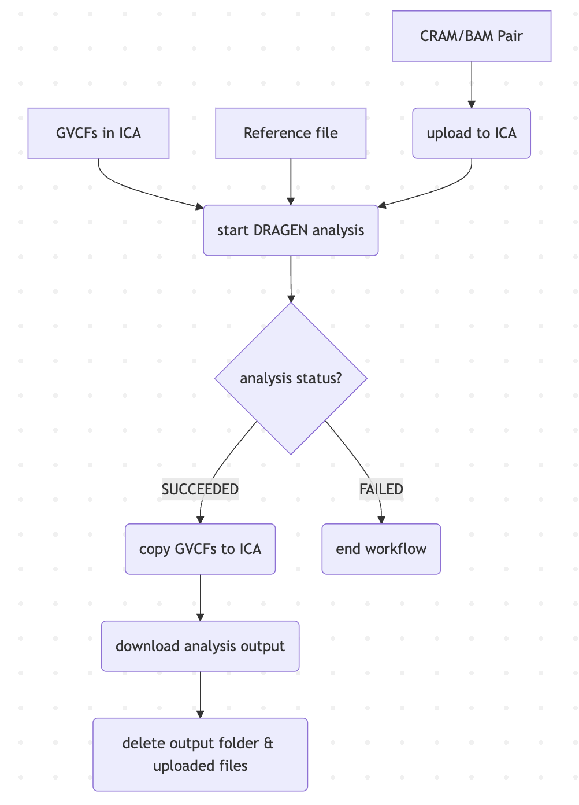

# ICA eLwazi  
## Introduction   
This is a simple proof of concept (POC) for automating certain processes that use the _Illumina Connected Analytics (ICA)_ CLI. The main processes that we wish to automate are:   

- uploading files for analysis
- run Nextflow pipelines for analysis
- trigger download of output file(s)
- delete output file after download succeeds   

We can use a combination of both the [API](https://ica.illumina.com/ica/api/swagger/index.html#/) and the [CLI](https://help.ica.illumina.com/command-line-interface/cli-indexcommands). However, we will almost exclusively use the CLI.   

Before we can begin, we need to have an existing project or create a new project. For the rest of this README, we'll be referring to the existing project, **SGDP**.   

## Authentication
Authentication is required in order to use the API or the CLI. After logging in to the UI, an API key needs to be created. Instructions for generating an API key can be found over [here](https://help.ica.illumina.com/get-started/gs-getstarted#api-keys).   

There are two ways to authenticate in order to make use of the API:
1. API key + JWT for the entire API, except for the POST `/tokens` endpoint.
2. API key + Basic Authentication (username/email and password) for the POST `/tokens` endpoint.    

When using the CLI, authentication takes place when running the command:
```bash
icav2 config set
```
There will be prompts. The defaults can be used by simply pressing `Enter` or `Return`. When the API key is prompted, provide the value that has been generated in the UI. 
```bash
icav2 config set
Creating $HOME/.icav2/config.yaml
Initialize configuration settings [default]
server-url [ica.illumina.com]: 
x-api-key : myAPIKey
output-format (allowed values table,yaml,json defaults to table) : 
colormode (allowed values none,dark,light defaults to none) :
```
The `$HOME/.icav2/config.yaml` file can be modified if the default settings are wished to be changed. In our case, our output format is JSON.   

Our goal is to create a process that achieves the following:   
- upload data to ICA
- start a pipeline run (or analysis) in ICA
- periodically check the status of the ongoing analysis
- download results when analysis is complete
- delete results and the uploaded files    

A diagram illustrating a single file upload-analysis-download-delete process can be seen below:   
   

## DRAGEN ICA Workflow for A Pair of FASTQ Files   
When running the **DRAGEN Germline Whole Genome 4-3-6** pipeline using a pair of .fastq files, we need to also provide a .csv file containg some metadata about the .fastq file pair. As an illustration, suppose the names of the .fastq files for a given analysis are __mysample_R1_001.fastq__ and __mysample_R2_001.fastq__, then the .csv file will contain the following data:   
```csv
RGID,RGSM,RGLB,Lane,Read1File,Read2File
mysample,mysample,RGLB,1,mysample_R1_001.fastq,mysample_R2_001.fastq
```   

Reference files for the DRAGEN pipelines always have a .tar extension. The reference file that we are interested in using is the __chm13_v2-cnv.hla.methylation_combined.rna_v4.tar.gz__, which is commonly referred to as T2T (or telomere-to-telomere). However, some of our analyses may require the use of the older reference, i.e. **_hg38-alt_masked.cnv.hla.methyl_cg.methylated_combined.rna-11-r5.0-2.tar.gz_**, which is commonly referred to as build38.     

The Nextflow pipeline (or workflow) responsible for the uploading, the triggering of a DRAGEN analysis, the polling of the analysis status, the downloading of the analysis results output, and then the deleting of the analysis output and the uploaded files can be found over [here](nextflow_workflows/fastq_input_dragen_ica_workflow/main.nf).    

     

### An Example of Using the Workflow on the Wits HPC Cluster
Suppose there exists a directory somewhere on the Wits HPC Cluster, say at location `/dataA/1000G`, where several FASTQ read pairs are stored, i.e. 
- `/dataA/1000G/SRR1291036_1.fastq.gz`
- `/dataA/1000G/SRR1291036_2.fastq.gz`
- `/dataA/1000G/SRR1291041_1.fastq.gz`
- `/dataA/1000G/SRR1291041_2.fastq.gz`
- `/dataA/1000G/SRR1293295_1.fastq.gz`
- `/dataA/1000G/SRR1293295_2.fastq.gz`   

It is convenient to create symlinks for these samples in our own home folder. For example, create a directory called `ica_data_uploads`. Inside this directory, create a new directory called `1000G` to specify the project to which these samples belong. Finally, create an individual directory for each read pair respectively, where the name of the directory corresponds to the sample ID, i.e. 
```bash
mkdir -p ica_data_uploads
cd ica_data_uploads
mkdir -p 1000G
cd 1000G
mkdir -p SRR1291036
mkdir -p SRR1291041
mkdir -p SRR1293295
```
We'd then like to create a symlink for the read pairs and the corresponding folder or directory whose name is the sample ID of the read pair. This can be done by running the following commands:
```bash
ln -s /dataA/1000G/SRR1291036_1.fastq.gz /home/regan/ica_data_uploads/1000G/SRR1291036
ln -s /dataA/1000G/SRR1291036_2.fastq.gz /home/regan/ica_data_uploads/1000G/SRR1291036

ln -s /dataA/1000G/SRR1291041_1.fastq.gz /home/regan/ica_data_uploads/1000G/SRR1291041
ln -s /dataA/1000G/SRR1291041_2.fastq.gz /home/regan/ica_data_uploads/1000G/SRR1291041

ln -s /dataA/1000G/SRR1293295_1.fastq.gz /home/regan/ica_data_uploads/1000G/SRR1293295
ln -s /dataA/1000G/SRR1293295_2.fastq.gz /home/regan/ica_data_uploads/1000G/SRR1293295
```
The above commands ensure that when accessing the directory, `/home/regan/ica_data_uploads/1000G/SRR1291036`, the two individual FASTQ read pairs `SRR1291036_1.fastq.gz` and `SRR1291036_2.fastq.gz` will both be available. Inside the [params.json](nextflow_workflows/fastq_input_dragen_ica_workflow/params.json), the key _"readsPairFilesUploadPath"_ can be assigned the value: "/home/regan/ica_data_uploads/1000G/**/*_{1,2}.fastq.gz". The double star (or asterisk) in the path means that Nextflow will look for the FASTQ read pairs in all folders and subfolders in the `/home/regan/ica_data_uploads/1000G` directory.    

To save time and to avoid potentially wasting money (credits), it is often a good idea to verify that none of the FASTQ files are corrupted. This can be done using the `sequence` module inside the Wits HPC cluster, i.e.
```bash
module load sequence
seqkit stats <file1> <file2>
```
The output of this command will provide some stats relating to the FASTQ reads. If the file is corrupted, an error will be thrown. A corrupted file should not be used, since the DRAGEN analysis would fail. However, even if a DRAGEN analysis fails halfway through the analysis, we will still be billed for compute.   

Once all the files have been validated and the necessary symlinks have been created, we can run any of these workflows by simply entering the directory where the `main.nf` and `params.json` files are in, and then running:
```bash
nextflow main.nf -params-file params.json
```   

Due to how long it can take to run the workflow on a batch of samples, it is more efficient to make use of Linux's [screen](https://www.geeksforgeeks.org/linux-unix/screen-command-in-linux-with-examples/) command. This allows us to detach from the terminal session but keeps the terminal session running in the background.   

Suppose we are on worker node number 4, i.e. `n04`. By running the command,
```bash
screen
```
we'll be taken to a blank terminal session. While in this terminal session, we can navigate to the desired directory and run the workflow with `nextflow run main.nf -params-file params.json`. Once it has started running, we can detach from the screen session by pressing (on the keyboard) **ctrl+A** and then pressing **D** to detach. After detaching, the terminal will display a reference for the currently detached screen session. This reference may look something like this: 
```bash
4084463.pts-21.n04
```
It's important to make a note of this reference, since it will be required later when reattaching to this screen session. To reattach, we simply run:
```bash
screen -r 4084463.pts-21.n04
```
Once reattached, we can see the progress of our running workflow. If it has failed, we should investigate why and try to fix and resume the workflow.   

## DRAGEN ICA Workflow for A BAM/CRAM and BAM/CRAM Index File Pair   
There are many similarities when using the DRAGEN ICA workflow with CRAM or BAM inputs. CRAM and BAM files also come in pairs. However, instead of being oppositely aligned reads, they instead come along with an index file (`.bam.bai` and `.cram.crai`, respectively). This means that the upload process in the workflow stays mostly the same when dealing with either FASTQ pairs or BAM/CRAM and their index pairs.   

The major difference comes with the pipeline parameters being specified in the **startAnalysis** process. For BAM/CRAM file input, the parameter "enable_map_align" needs to be false, since realignment is not required when using BAM/CRAM as input. Since this parameter is false, there are other parameters that necessarily become false as well.   

When using the T2T (or chm13) reference, it is important to set the parameter `repeat_genotype_enable` to _false_. Furthermore, the T2T (or chm13) reference cannot be used directly with the AGenDA data, since the CRAM files from this data was created from the hg38 reference. To get around this, we need to specify the CRAM reference and the T2T reference in command for running the germline whole genome sequence pipeline.   

The entire workflow for BAM input can be found over [here](nextflow_workflows/bam_input_dragen_ica_workflow/main.nf), and for CRAM input over [here](nextflow_workflows/cram_input_dragen_ica_workflow/main.nf).   

## DRAGEN ICA Workflow for Joint Genotyping
We need to investigate the best way to go about performing joint genotyping on a batch of samples. The ICA pipeline to use is the **DRAGEN_Joint_Pedigree_Calling_4-4-4**. As part of the pipeline parameters, we need to note the following:
- For our purposes, we will not be using a pedigree file (this file describes the relationship among the different samples).
- We need to provide a list or set of GVCFs for comparison. These GVCF files need to be uploaded to the ICA platform _before_ running the joint genotyping pipeline.
- If performing joint genotyping on CNVs, then we will need to provide normalized TSV files generated from DRAGEN CNV calling. These TSV files would also need to be uploaded to the ICA platform before running the joint genotyping pipeline.   

We note that in order to perform joint genotyping on a sample, we need access to the GVCFs of related samples that were generated from a DRAGEN analysis. For automation purposes, whenever a DRAGEN analysis completes successfully, we should copy the relevant GVCF files from the output folder to a location inside the ICA platform _before_ downloading and deleting the output folder. This is so that when the next sample gets analysed, it can have the most recent GVCF files included in the comparison. It also saves us from having to reupload the GVCFs.    

   

In order to run a joint genotyping analysis, we need to specify a list of `.gvcf.gz` files in the ICA platform. We can get these `.gvcf.gz` files by performing analyses with the DRAGEN Germline Whole Genome 4-4-4 pipeline. We can then upload all the `.gvcf.gz` files to a specified folder in ICA, i.e. a folder named `/GVCFs`.   

A helper Bash script has been created for the bulk uploading of these GVCFs. The script for this bulk uploading of GVCFs is [upload_multiple_GVCFs.sh](bash_scripts/upload_multiple_GVCFs.sh), and the `txt` file containing the paths of the files to be uploaded can be found in the script [GVCFs_to_be_uploaded.txt](bash_scripts/txt_files/GVCFs_to_be_uploaded.txt).   

The `repeats.vcf.gz` files can also be provided as input. These should be uploaded to a separate folder in the ICA platform, i.e. `/Repeats`.   

The `tn.tsv.gz` files can also be provided as input. These should be uploaded to a separate folder in the ICA platform, i.e. `/Normalized_TSV_Files`.   

Using the `icav2` command line tool, we need to either specify each `gvcf.gz` variant with the flag `--variant`, or we can provide the flag `--variant-list` which provides the path of a text file containing the absolute paths of all variants to be used. If using the latter method, it is advisable to keep the order of the variants the same for all subsequent analyses. In keeping with our usual pattern of using the data IDs of the files/folders in ICA, we can simply use the `--input` flag with the appropriate analysis code for the respective files/folders. Here is an example of how the `icav2` command would look:
```nextflow
    analysis_response=\$(icav2 projectpipelines start nextflow ${pipelineId} \
        --project-id ${projectId} \
        --user-reference ${userReference} \
        --storage-size ${storageSize} \
        --input ${referenceAnalysisDataCode}:${referenceFileId} \
        --input ${cramAnalysisDataCode}:\${cram_file_id} \
        --input ${cramIndexAnalysisDataCode}:\${crai_file_id} \
        --input ${tsvFilesAnalysisCode}:"${tsvFileId01},${tsvFileId02},${tsvFileId03},${tsvFileId04}" \
        --input ${gvcfFilesAnalysisCode}:"${gvcfFileId01},${gvcfFileId02},${gvcfFileId03},${gvcfFileId04}" \
        --parameters enable_joint_genotyping:true \
        --parameters enable_variant_caller:true \
        --parameters vc_emit_ref_confidence:GVCF \
        --parameters vc_enable_vcf_output:true \
        --parameters enable_cnv:true \
        --parameters enable_sv:true \
        --parameters repeat_genotype_enable:false \
        --parameters enable_map_align:false \
        --parameters enable_map_align_output:false \
        --parameters enable_duplicate_marking:false \
        --parameters enable_hla:false \
        --parameters enable_variant_annotation:false \
        --parameters output_file_prefix:"\${sample_id}")
```
The analysis codes for the different input types can be found in ICA itself (although the values are contained in the different `params.json` files inside this repo). The IDs for the desired TSV and GVCF files need to be specified in the `params.json` file.   

## Acknowledgements
   

The eLwazi Open Data Science Platform is supported by the Office Of The Director, National Institutes Of Health (OD), National Institution of Biomedical Imaging and Bioengineering, and NIH award number 1 U2C EB 032224. This workflow is also partially supported by a grant from the South African Medical Research Council through a Strategic Health Initiative Partnership.  This work is solely the responsibility of the authors and does not necessarily represent the official views of the funder.
