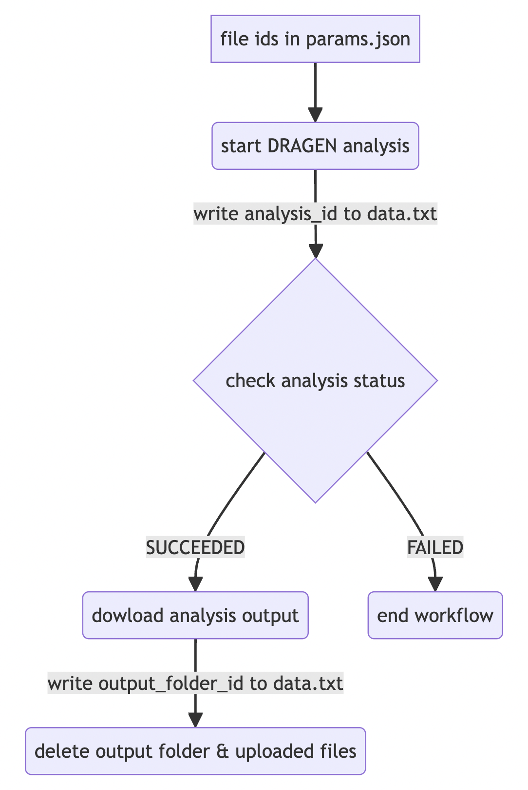

# ica-v2-poc   
## Introduction   
This is a simple proof of concept (POC) for automating certain processes that use the _Illumina Connected Analytics (ICA)_ CLI. The main processes that we wish to automate are:   

- uploading files for analysis
- run Nextflow pipelines for analysis
- trigger download of output file(s)
- delete output file after download succeeds   

We can use a combination of both the [API](https://ica.illumina.com/ica/api/swagger/index.html#/) and the [CLI](https://help.ica.illumina.com/command-line-interface/cli-indexcommands). However, we will almost exclusively use the CLI.   

Before we can begin, we need to have an existing project or create a new project. For the rest of this README, we'll be referring to the existing project, **SGDP**.   

## Authentication
Authentication is required in order to use the API or the CLI. After logging in to the UI, an API key needs to be created. Instructions for generating an API key can be found over [here](https://help.ica.illumina.com/account-management/am-iam#api-keys).   

There are two ways to authenticate in order to make use of the API:
1. API key + JWT for the entire API, except for the POST `/tokens` endpoint.
2. API key + Basic Authentication (username/email and password) for the POST `/tokens` endpoint.    

When using the CLI, authentication takes place when running the command:
```bash
icav2 config set
```
There will be prompts. The defaults can be used by simply pressing `Enter` or `Return`. When the API key is prompted, provide the value that has been generated in the UI. 
```bash
icav2 config set
Creating $HOME/.icav2/config.yaml
Initialize configuration settings [default]
server-url [ica.illumina.com]: 
x-api-key : myAPIKey
output-format (allowed values table,yaml,json defaults to table) : 
colormode (allowed values none,dark,light defaults to none) :
```
The `$HOME/.icav2/config.yaml` file can be modified if the default settings are wished to be changed. In our case, our output format is JSON.   

Our goal is to create a process that achieves the following:   
- upload data to ICA
- start a pipeline run (or analysis) in ICA
- periodically check the status of the ongoing analysis
- download results when analysis is complete
- delete results and the uploaded files    

A diagram illustrating a single file upload-analysis-download-delete process can be seen below:   
   

## DRAGEN Pipeline for Pair of FASTQ Files   
When running the **DRAGEN Germline Whole Genome 4-3-6** pipeline using a pair of .fastq files, we need to also provide a .csv file containg some metadata about the .fastq file pair. As an illustration, suppose the names of the .fastq files for a given analysis are __mysample_R1_001.fastq__ and __mysample_R2_001.fastq__, then the .csv file will contain the following data:   
```csv
RGID,RGSM,RGLB,Lane,Read1File,Read2File
mysample,mysample,RGLB,1,mysample_R1_001.fastq,mysample_R2_001.fastq
```   
The reference file to be used is the __chm13_v2-cnv.hla.methylation_combined.rna_v4.tar.gz__. Reference files for the DRAGEN pipelines always have a .tar extension.   

The Nextflow pipeline (or workflow) responsible for the uploading, triggering of DRAGEN analysis, polling analysis status, downloading output, and then deleting the analysis output and uploaded files can be found over [here](pipelines/nextflow/fastq_single_pair_dragen_analysis_with_upload/main.nf).    

    

(The above diagram was generated using the [Mermaid Live Editor](https://mermaid.live/) with the following markup code:   
```bash
flowchart LR
    A[FASTQ reads] --> D(upload to ICA)
    B[reference file] --> D(upload to ICA)
    C[CSV file of FASTQ reads] --> D(upload to ICA)
    D(upload to ICA) --> |write file ids to data.txt| E(start DRAGEN analysis)
    E(start DRAGEN analysis) --> |write analysis_id to data.txt| F{check analysis status}
    F{analysis status?} --> |SUCCEEDED| G(dowload analysis output)
    F{analysis status?} --> |SUCCEEDED| G(dowload analysis output)
    F{analysis status?} --> |FAILED| H(end workflow)
    G(dowload analysis output) --> |write output_folder_id to data.txt| I(delete output folder & uploaded files)
```
)   

The workflow passes data from process to process in the form of a .txt file called `data.txt`. All necessary data (like ids) gets written to the `.txt` file as the workflow implements the different processes. This is an example of what the `data.txt` file would look like:   
```txt
sampleId:ERR1019050
read1:fil.85255ad2588d4e5fe75a08dcaabcc45f
read2:fil.6bcfeca6252941dde75b08dcaabcc45f
ref_tar:fil.2e3fd8d802ee4963da2208dc484ea8f0
read1Name:ERR1019050_R1_001.fastq
read2Name:ERR1019050_R2_001.fastq
analysisId:9aa57a35-7e66-4d4e-9c05-729767ff0290
analysisRef:regan_dragen_germline_whole_genome_test_05-DRAGEN Germline Whole Genome 4-3-6-a7f59145-3f93-4579-9129-c2b726dc4414
outputFolderId:fol.7cdafdb7363062eef75b08edbbcdd56a
```   

If the files are already in ICA and don't need to be uploaded, then a shorter workflow can be used, i.e. the [fastq_single_pair_dragen_analysis_no_upload](pipelines/nextflow/fastq_single_pair_dragen_analysis_no_upload/) workflow. This workflow skips the upload process. Consequently, the file ids of the already uploaded files will need to be provided in the `params.json`.   

    

Finally, an even shorter workflow exists, i.e. the [fastq_single_pair_dragen_analysis_download](pipelines/nextflow/fastq_single_pair_dragen_analysis_download/) workflow. This one is to be used when files have already been uploaded and the DRAGEN analysis has already run to completion. In that case, only the download and delete processes are required.   

    

To run any of these workflows, simply enter the directory where the `main.nf` and `params.json` files are in, and then run:
```
nextflow main.nf -params-file params.json
```

## DRAGEN Pipeline for BAM Files
When running the **DRAGEN Germline Whole Genome 4-3-6** pipeline using a .bam file as input, the .bam indexes (.bai) are required when _realignment is disabled_. Since all the .bam files are stored in a single directory, the _sampleId_ needs to be provided in the `params.json` so that we know which file to upload and analyse. The corresponding index file (.bam.bai) will also be uploaded. The workflow for the uploading, triggering of DRAGEN analysis, polling analysis status, downloading analysis output, and deleting output and uploaded files can be found over [here](pipelines/nextflow/bam_single_dragen_analysis_with_upload/).   

Similarly to the workflow logic for the .fastq files, data gets written to a .txt file called `data.txt`. This is an example of what the `data.txt` file would look like:   
```txt
sampleId:myBamFile
bam:fil.85255ad2588d4e5fe75a08dcaabcc45f
bai:fil.6bcfeca6252941dde75b08dcaabcc45f
ref_tar:fil.2e3fd8d802ee4963da2208dc484ea8f0
bamFileName:myBamFile.bam
baiFileName:myBamFile.bam.bai
analysisId:9aa57a35-7e66-4d4e-9c05-729767ff0290
analysisRef:regan_dragen_germline_whole_genome_test_05-DRAGEN Germline Whole Genome 4-3-6-a7f59145-3f93-4579-9129-c2b726dc4414
outputFolderId:fol.7cdafdb7363062eef75b08edbbcdd56a
```   

## Acknowledgements
   

The eLwazi Open Data Science Platform is supported by the Office Of The Director, National Institutes Of Health (OD), National Institution of Biomedical Imaging and Bioengineering, and NIH award number 1 U2C EB 032224. This workflow is also partially supported by a grant from the South African Medical Research Council through a Strategic Health Initiative Partnership.  This work is solely the responsibility of the authors and does not necessarily represent the official views of the funder.