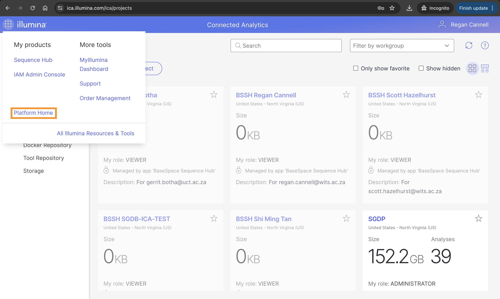
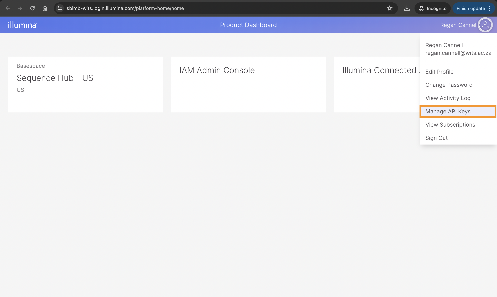

## Authentication
Authentication is required in order to use the API or the CLI. After logging in to the UI, an API key needs to be created. On the _Illumina Projects_ page, the dropdown list that appears when clicking on the logo on the top left of the navigation bar contains the option _Platform Home_.    

   

On the _Platform Home_ page, the user icon on the top right, when clicked, displays a dropdown list with the _Manage API Keys_ option. This option opens a new page where API keys can be generated.   

   

More detailed instructions for generating an API key can be found over [here](https://help.ica.illumina.com/account-management/am-iam#api-keys).   

There are two ways to authenticate in order to make use of the API:
1. API key + JWT for the entire API, except for the POST `/tokens` endpoint.
2. API key + Basic Authentication (username/email and password) for the POST `/tokens` endpoint.    

When using the CLI, authentication takes place when running the command:
```bash
icav2 config set
```
There will be prompts. The defaults can be used by simply pressing `Enter` or `Return`. When the API key is prompted, provide the value that has been generated in the UI. 
```bash
icav2 config set
Creating $HOME/.icav2/config.yaml
Initialize configuration settings [default]
server-url [ica.illumina.com]: 
x-api-key : myAPIKey
output-format (allowed values table,yaml,json defaults to table) : 
colormode (allowed values none,dark,light defaults to none) :
```
The `$HOME/.icav2/config.yaml` file can be modified if the default settings are wished to be changed. In our case, our output format is JSON.   

Our goal is to create a process for the uploading of data to ICA, starting a pipeline run (or analysis) of the uploaded data, check the status of the analysis or output files periodically, download the results, and then finally clean up the storage in ICA (delete output and uploaded files). A diagram illustrating a single file upload-analysis-download-delete process can be seen below:   
  