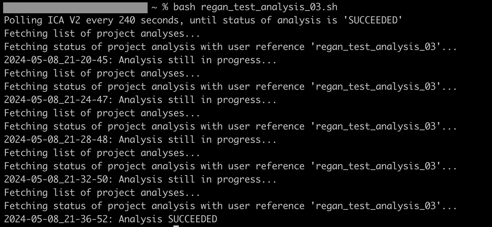

## Polling the Status of a Pipeline Run (or Analysis)   
We would like to download the output files after the analysis is complete and successful, i.e. the status should be **"SUCCEEDED"**. The possible values are:
- REQUESTED 
- QUEUED 
- INITIALIZING 
- PREPARING_INPUTS 
- IN_PROGRESS 
- GENERATING_OUTPUTS 
- AWAITING_INPUT 
- ABORTING 
- SUCCEEDED 
- FAILED 
- FAILED_FINAL 
- ABORTED   

We can use a simple polling mechanism to keep checking the status of the analysis. When the status of the analysis is **SUCCEEDED**, then we can proceed to download the data. If the status is any one of **FAILED**, **FAILED_FINAL**, or **ABORTED**, then the polling `bash` script should be terminated. The [get_projectanalysis_status_by_user_reference.sh](./../bash/helper_scripts/get_projectanalysis_status_by_user_reference.sh) script checks the status of a running analysis periodically (the time interval can be set by the developer). Here is a screenshot of an example of its implementation:    

  