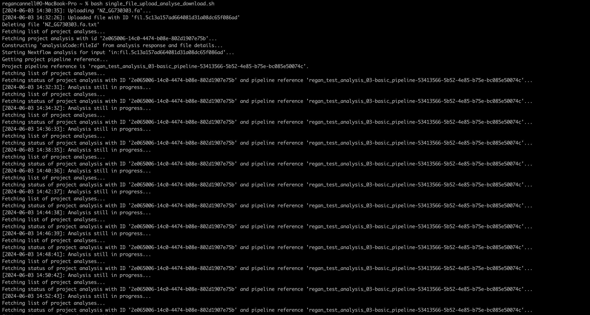
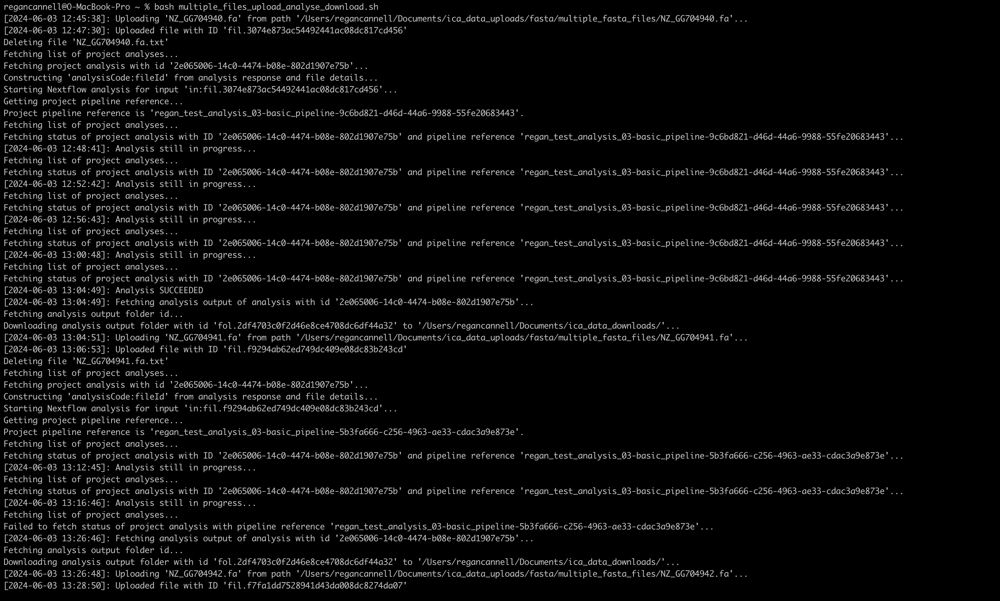

## Single File Upload-Analyse-Download Process 
The entire process is to be run with `bash` commands in a Nextflow pipeline (not to be confused with the Nextflow pipeline that resides in the ICA and that will perform the analysis).   

    

The bash script for the full process of uploading a single file, analysing it, and then downloading its output can be found in the [single_file_upload_analyse_download.sh](./../bash/single_file_upload_analyse_download.sh) script.    
 

The bash script for the full process of uploading a multiple files, analysing each one, and then downloading the output can be found in the [multiple_files_upload_analyse_download.sh](./../bash/multiple_files_upload_analyse_download.sh) script.   
    

The Nextflow pipeline that implements the aforementioned bash scripts can be found over [here](./../pipelines/nextflow/single_file_upload_for_basic_pipeline/main.nf). The pipeline can be run with the command (inside the directory containing `main.nf` and `params.json`):
```bash
nextflow run main.nf -params-file params.json
```   
