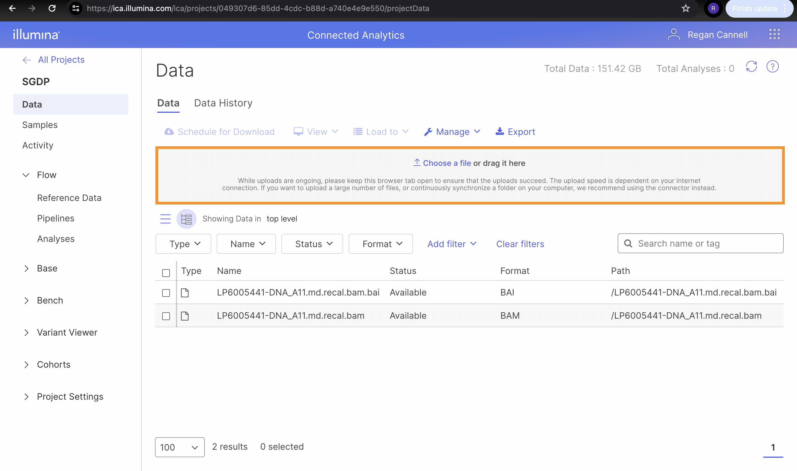

## Uploading Files to Illumina Connected Analytics   
### Uploading Single Files
We can use the UI to upload a file to a project.   


However, we will mostly use the CLI. Instead of specifying the `project_id` every time we make requests to ICA, we can set the project context. To set the project context, run the following command:
```bash
icav2 projects enter <projectId>
```
If the command runs successfully, then a response like
```bash
"Context switched to project <projectId>"
```
should be received. Now the terminal session will be in the specified project's context. It's possible to now upload a file to the project with:
```bash
icav2 projectdata upload </local/path/of/file>
```
If a remote path for uploading is not specified, the data will be uploaded to the top level of the project's storage folder.   

Without setting the project context, the `project_id` will need to be explicitly stated, i.e.
```bash
icav2 projectdata upload </local/path/of/file> --project-id <project_id>
```   
Here is an example of uploading a file from the location `Documents/ica_data_uploads/fastq/1_control_trnL_2019_minq7.fastq` and the JSON response received:   
```bash
icav2 projectdata upload Documents/ica_data_uploads/fastq/1_control_trnL_2019_minq7.fastq \ 
--project-id 049307d6-85dd-4cdc-b88d-a740e4e9e550
```
   

```json
{
	"details": {
		"creatorId": "eb6b7257-1545-4cfb-a5cd-3b30f800a356",
		"dataType": "FILE",
		"fileSizeInBytes": 0,
		"format": {
			"code": "FASTQ",
			"description": "FASTQ format is a text-based format for storing both a biological sequence (usually nucleotide sequence) and its corresponding quality scores.",
			"id": "7674cc19-2ab7-42fe-bac3-be16c83c720c",
			"ownerId": "499bfe9d-85bd-4588-ba70-fbc2f664bb9e",
			"tenantId": "9fec8354-853b-4ee5-b211-eb03e484d876",
			"tenantName": "Illumina",
			"timeCreated": "2021-10-29T09:44:27Z",
			"timeModified": "2021-10-29T09:44:27Z"
		},
		"name": "1_control_trnL_2019_minq7.fastq",
		"owningProjectId": "049307d6-85dd-4cdc-b88d-a740e4e9e550",
		"owningProjectName": "SGDP",
		"path": "/1_control_trnL_2019_minq7.fastq",
		"region": {
			"cityName": "North Virginia",
			"code": "US",
			"country": {
				"code": "US",
				"id": "99f932f8-bc5b-419c-854c-872a5a00cbae",
				"name": "United States",
				"ownerId": "499bfe9d-85bd-4588-ba70-fbc2f664bb9e",
				"region": "earth",
				"tenantId": "9fec8354-853b-4ee5-b211-eb03e484d876",
				"tenantName": "Illumina",
				"timeCreated": "2021-10-29T09:44:26Z",
				"timeModified": "2021-10-29T09:44:26Z"
			},
			"id": "c39b1feb-3e94-4440-805e-45e0c76462bf",
			"ownerId": "8ec463f6-1acb-341b-b321-043c39d8716a",
			"tenantId": "f91bb1a0-c55f-4bce-8014-b2e60c0ec7d3",
			"tenantName": "ica-cp-admin",
			"timeCreated": "2021-11-05T09:57:38Z",
			"timeModified": "2024-04-25T20:48:22Z"
		},
		"status": "PARTIAL",
		"storedForTheFirstTimeAt": "2024-05-02T08:24:54Z",
		"tags": {
			"connectorTags": [],
			"referenceTags": [],
			"runInTags": [],
			"runOutTags": [],
			"technicalTags": [],
			"userTags": []
		},
		"tenantId": "02ea1bcf-6b20-4cbf-a9b2-724d1833eb07",
		"tenantName": "sbimb-wits",
		"timeCreated": "2024-05-02T08:24:54Z",
		"timeModified": "2024-05-02T08:24:54Z"
	},
	"id": "fil.178b9b4066234c0db33908dc6a426494",
	"urn": "urn:ilmn:ica:region:c39b1feb-3e94-4440-805e-45e0c76462bf:data:fil.178b9b4066234c0db33908dc6a426494#/1_control_trnL_2019_minq7.fastq"
}
```
Notice that the JSON response contains an `"id"` key that begins with _"fil"_. We can store that value inside a variable and use it to make subsequent requests using the CLI. For instance, we can get the file details with:
```bash
icav2 projectdata get <file-id> --project-id <project-id>
```   
We have a [script](./../bash_scripts/get_uploaded_file_id.sh) in the `/bash` directory that extracts the `file_id` programmatically using certain `bash` commands.    

### Uploading Multiple Files or A Folder
To upload multiple files, we can use the following command:
```bash
find $source -name '*.fastq.gz' | xargs -n 1 -P 10 -I {} icav2 projectdata upload {} /$target/
```
To upload a folder, we can use the following command:
```bash
icav2 projectdata upload </local/path/of/folder> --project-id <projectId>
```
The response from this process will allows us to extract the `folderId` and `folderUploadSessionId`. We can then use these parameters to get details of the folder upload session, i.e.   
```bash
icav2 projectdata folderuploadsession --project-id <projectId> <folderId> <folderUploadSessionId>
```
