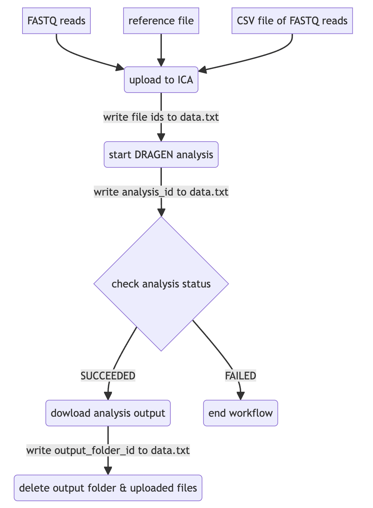

## Using the Mermaid Live Editor for Flowcharts

The following diagram is an example of a flowchart that has been generated using the [Mermaid Live Editor](https://mermaid.live/):    

    

The flowchart was generated using the following markup code:   
```bash
flowchart LR
    A[FASTQ reads] --> D(upload to ICA)
    B[reference file] --> D(upload to ICA)
    C[CSV file of FASTQ reads] --> D(upload to ICA)
    D(upload to ICA) --> |write file ids to data.txt| E(start DRAGEN analysis)
    E(start DRAGEN analysis) --> |write analysis_id to data.txt| F{check analysis status}
    F{analysis status?} --> |SUCCEEDED| G(download analysis output)
    F{analysis status?} --> |FAILED| H(end workflow)
    G(download analysis output) --> |write output_folder_id to data.txt| I(delete output folder & uploaded files)
``` 